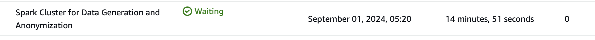

# The Solutions for Data Engineering Coding Challenges

## Problem 1 - Parse fixed width file

### Running Locally

To run the tests or the main script using Docker locally, follow these steps:

1. Build the Docker Image

    Navigate to the project root directory and build the Docker image:

    ```bash
    docker build -t fixed-width-parser problem_1/
    ```

2. Run Unit Tests

    Use the RUN_TESTS=true environment variable to run the tests:

    ```bash
    docker run --rm -v $(pwd)/problem_1/output:/app/output -e RUN_TESTS=true fixed-width-parser
    ```

3. Run the Main Python Script

    Run the Docker container without the RUN_TESTS environment variable:

    ```bash
    docker run --rm -v $(pwd)/problem_1/output:/app/output fixed-width-parser
    ```

    This will execute the `fixed_width_parser.py` script inside the container and output the files in the subdirectory `/problem_1/output`.

    After running the command, check the `/problem_1/output` directory in your project root. You should see the following files:
    - `output_fixed_width.txt`: contains the fixed-width formatted data as specified in spec.json.
    - `output_data.csv`: contains the parsed, comma-separated values.


## Problem 2 - Data processing

### Running Locally for small files

To run the tests or the main script using Docker locally for small file, follow these steps:

1. Build the Docker Image

    Navigate to the project root directory and build the Docker image:

    ```bash
    docker build -t data-processing problem_2/
    ```

2. Run Unit Tests

    Use the RUN_TESTS=true environment variable to run the tests:

    ```bash
    docker run --rm -v $(pwd)/problem_2/output:/app/output -e RUN_TESTS=true data-processing
    ```

3. Run the Main Python Script

    - To generate a small CSV file (e.g., 1MB), run the following command:

        ```bash
        docker run --rm -v $(pwd)/problem_2/output:/app/output -e TASK=generate_csv -e FILE_SIZE=0.002 -e OUTPUT_FILE=/app/output/generated_data.csv data-processing
        ```

        This will generate a small CSV file `/problem_2/output/generated_data.csv`.

    - To anonymize the generated CSV file, use the following command: 

        ```bash
        docker run --rm -v $(pwd)/problem_2/output:/app/output -e TASK=anonymize_data -e INPUT_FILE=/app/output/generated_data.csv -e OUTPUT_FILE=/app/output/anonymized_data.csv data-processing
        ```

        This will generate a small CSV file `/problem_2/output/anonymized_data.csv` with anonymous name `JOHN DOE` and address `123 Main Street, City, State`.

### Running on AWS EMR for large files

To efficiently process large file (> 2GB) on AWS EMR, follow these steps:

1. Upload files to S3 bucket
    Navigate to the directory `program_2`  and upload `generate_csv.py`, `anonymize_data.py` and `install_faker.sh` to your S3 bucket.

    `install_faker.sh` includes bootstrap actions to install required Python packages.

    ```bash
    aws s3 cp generate_csv.py s3://your-bucket-name/scripts/
    aws s3 cp anonymize_data.py s3://your-bucket-name/scripts/
    aws s3 cp install_faker.sh s3://your-bucket-name/scripts/
    ```

2. Create EMR Cluster

    Create an EMR cluster with Spark installed. Use the following `aws emr create-cluster` command, which includes bootstrap actions to install required Python packages and steps to run the scripts:

    ```bash
    aws emr create-cluster \
    --name "Spark Cluster for Data Generation and Anonymization" \
    --use-default-roles \
    --release-label emr-6.7.0 \
    --applications Name=Spark \
    --instance-type m5.xlarge \
    --instance-count 3 \
    --log-uri s3://your-bucket-name/logs/ \
    --ec2-attributes KeyName=my-emr-key-pair \
    --bootstrap-actions Path=s3://your-bucket-name/scripts/install_faker.sh \
    --steps file://emr_steps.json \
    --enable-debugging
    ``

3. Verify Output
 - Time: Generating 2GB csv files and anonymizing it took almost 15 mins on AWS EMR.
    

    - Logs: Check the EMR logs in the specified S3 bucket to verify the cluster and step executions.

    - Output Files: Check the s3://your-bucket-name/output/ directory for the generated_data.csv and anonymized_data.csv files.

The approach demonstrated for a 2GB dataset can be scaled to handle much larger datasets by adjusting the cluster size and configuration:

- Increase Instance Count: For larger datasets, increase the number of core and task nodes to distribute the workload. For example, use --instance-count 5 or more.

- Use Larger Instance Types: For more memory and CPU, use larger instance types like m5.2xlarge or m5.4xlarge.

- Adjust Step Configuration: Modify Spark configurations (e.g., executor memory, cores) in the Args list of the spark-submit command to optimize performance.


